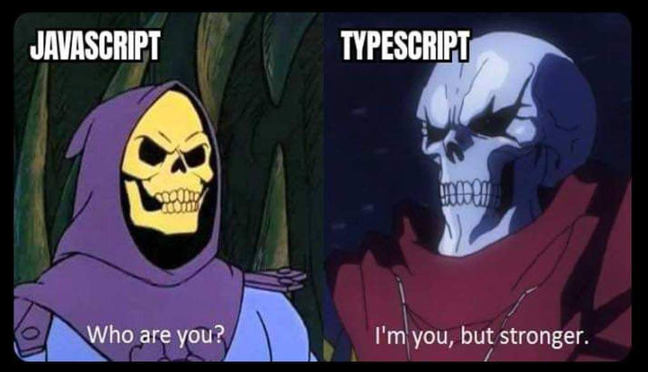

# entra21 aulas-frontend-typescript
Repositório com as práticas realizadas em aula 

> Conteúdo prático realizado em sala durante o projeto Entra21
> Em aditivo oportunidades de aprendizado em:
> - Versionamento
> - Linguagem markdown
> - Documentação

## Aula Ministradas

| AULA | ASSUNTO |
|------|---------|
|Aula 01 | Consumo no html / Variáveis tipadas / Funções tipadas
|Aula 02 | Orientação a objetos / Criar entidades
|Aula 03 | Implementar herança / Resultado / Exercício de fim de módulo